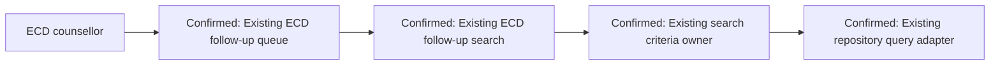

# Fictional Example A — DeepWiki Available

This concise example demonstrates the repository-research path. All findings are fictional test evidence and must not be treated as facts about the real repositories.

## Request

Approved Story `DEMO-ECD-241`: let an ECD counsellor filter the existing child follow-up queue by due-date range and call outcome. The BRD and FRD require reuse of the existing queue and prohibit a new service or database table. Confluence identifies ECD as the owning service line. OpenAPI identifies an existing paginated follow-up search operation.

## Repository shortlist

The official DeepWiki capability was available in this fictional host.

| Repository | Reason selected | Result |
|---|---|---|
| `PSMRI/ECD-UI` | ECD counsellor screen and filter behavior | Inspected |
| `PSMRI/ECD-API` | Existing follow-up search contract and query ownership | Inspected |

`PSMRI/Common-UI`, `PSMRI/Common-API`, `PSMRI/AMRIT-DB`, and `PSMRI/AMRIT-DevOps` were not searched. The Story introduced no shared UI, integration, schema, deployment, or configuration concern, and the two primary repositories answered the design questions.

## Existing Architecture Summary

Fictional DeepWiki evidence reported:

- **Confirmed:** `PSMRI/ECD-UI` contains the existing paginated follow-up queue feature, a reusable date-range filter control, and the established query-state pattern.
- **Confirmed:** `PSMRI/ECD-API` contains the existing follow-up search controller, service-layer criteria construction, repository query adapter, and pagination convention.
- **Confirmed:** A similar ECD call-history screen combines optional date and outcome criteria without introducing a separate endpoint.
- **Inferred:** The same optional-criteria pattern is the intended extension point for the follow-up queue because it is used consistently in two retrieved search flows.
- **Unknown:** Repository evidence did not establish the maximum permitted date range.

## Design correction caused by repository evidence

Before repository research, a separate `Proposed Follow-Up Filter API` was a plausible conceptual option.

After research, the design was revised:

- Reuse the existing ECD follow-up queue and search operation.
- Extend the existing optional search criteria with due-date range and outcome.
- Reuse the UI date-range control and query-state behavior.
- Keep pagination, authorization, exception mapping, and repository ownership unchanged.
- Do not create a new endpoint, service, table, or shared-library dependency.

The revision avoids duplicate search orchestration and follows the current ECD architecture.

## HLD excerpt

**Current architecture — Confirmed:** ECD UI queue → ECD API search entry point → existing search service → repository query adapter.

**Proposed architecture:** Add two optional criteria at the existing UI and API boundaries. Preserve the current component chain and pagination contract.

## LLD excerpt

| Element | Classification | Design impact |
|---|---|---|
| Existing follow-up queue | Confirmed | Add due-date and outcome controls using the retrieved filter pattern |
| Existing search request model | Confirmed | Add optional criteria compatibly |
| Existing criteria builder | Confirmed | Extend current conditional criteria construction |
| Existing repository query adapter | Confirmed | Apply filters while preserving stable pagination |
| Maximum date range | Unknown | Architect/Product confirmation required before implementation |

No exact file path is repeated here because the fictional tool evidence is summarized rather than presented as a stable source link.

## Repository validation

The final HLD/LLD was checked against the fictional repository evidence:

- no duplicate module or service;
- no missed reusable filter;
- existing layer ownership preserved;
- current pagination and error conventions retained;
- no database or DevOps repository impact;
- no unnecessary cross-service coupling.

## Technical Design Status

**Ready for Architect Review**

**No implementation should begin until the design is reviewed.**
