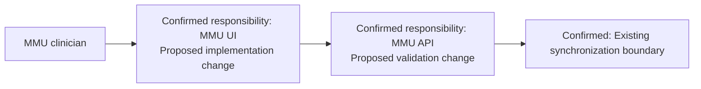

# Fictional Example B — DeepWiki Unavailable

This concise example demonstrates graceful fallback. It does not describe a real AMRIT deployment.

## Request and completed research

Approved Story `DEMO-MMU-318`: allow an MMU clinician to mark a consultation summary as reviewed before synchronization.

Research completed without DeepWiki:

- **Jira:** Story, acceptance criteria, linked Epic, related synchronization defect, and duplicate search.
- **BRD/FRD:** Review is optional metadata; existing consultation status must not change.
- **Workflow:** Clinician reviews the summary before the current synchronization action.
- **Confluence:** MMU UI owns the review interaction; MMU API owns authoritative validation; existing synchronization behavior remains in scope.
- **Swagger/OpenAPI:** The consultation update contract can accept an additive optional review marker; existing consumers must remain compatible.

## Optional Repository Intelligence

The current host exposed no applicable official DeepWiki repository tools.

**Repository research was not available in the current environment.**

The repository phase was skipped. The design continued normally; no installation request or nonexistent tool invocation was made.

## Existing Architecture Summary

- Likely catalog shortlist for later verification: `PSMRI/MMU-UI` and `PSMRI/MMU-API`.
- No repository was inspected.
- No class, package, file, table, or exact extension point is claimed.
- **Implementation-specific components below are proposals and require repository verification.**

## Impact excerpt

| Area | Design conclusion | Evidence classification |
|---|---|---|
| MMU UI | Add review interaction before existing sync action | Proposed implementation; workflow responsibility Confirmed by Confluence |
| MMU API | Validate actor and review state | Proposed implementation; ownership Confirmed by Confluence |
| API contract | Add optional review metadata compatibly | Proposed contract based on OpenAPI analysis |
| Database | Persistence impact remains to be verified against the current schema | Unknown |
| Synchronization | Preserve existing status and sync trigger | Confirmed requirement |
| DevOps | No impact identified from available evidence | Proposed conclusion pending repository verification |

## Conceptual HLD

Reuse the confirmed MMU UI → MMU API → synchronization boundary. Add review capture and authoritative validation without adding a service or changing consultation lifecycle.

## Proposed LLD

1. The existing consultation-summary screen presents a review action.
2. A proposed request DTO carries optional review intent; its exact name and location require repository verification.
3. A proposed application-layer rule authorizes the clinician and prevents contradictory review state.
4. Persistence reuses the current consultation aggregate if the schema supports it; otherwise the database design must be revised after schema inspection.
5. The existing synchronization flow carries the additive metadata without changing consultation status.
6. Failures use the existing API convention identified in OpenAPI and Confluence; exact exception classes are Unknown.

No fake files, classes, packages, repository adapters, or current table names are supplied.

## Architect Review Checklist additions

- Verify the proposed UI and application-layer extension points in `PSMRI/MMU-UI` and `PSMRI/MMU-API`.
- Confirm whether current persistence already represents review metadata.
- Inspect `PSMRI/AMRIT-DB` only if schema change remains plausible after application-repository research.
- Check current sync mapping, authorization, transaction, audit, and test conventions.

## Technical Design Status

**Ready for Architect Review**

**No implementation should begin until the design is reviewed.**
