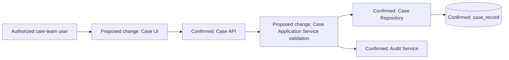

# Technical Design — Case Follow-Up Scheduling

> Fictional condensed example. All component names and contracts are supported by [sample-story-input.md](sample-story-input.md) and do not describe a real AMRIT deployment.

## 1. Document Control and Evidence Legend

| Field | Value |
|---|---|
| Stories | `DEMO-4821`, `DEMO-4822` |
| Approved sources | `BRD-DEMO-17`, `FRD-DEMO-17` |
| Current architecture | `Case Management — Current Architecture` v6 |
| API evidence | `Case API` v1.8 |
| Research result | Relevant Confluence, OpenAPI, repository, and Jira evidence reviewed |
| Scope | Schedule, reschedule, or clear a case follow-up |
| Excluded | Notifications, reporting, new integration, new endpoint, schema change |

- **Confirmed** — directly supported by the fictional sample evidence.
- **Inferred** — strongly indicated by retrieved repository patterns but not directly confirmed.
- **Assumed** — requires confirmation.
- **Proposed** — design choice for Architect review.
- **Unknown** — evidence is unavailable or insufficient.

## 2. Executive Summary

**Proposed:** Extend the existing case-closure and case-edit UI flows to expose the already-supported `followUpAt` field. Keep the Case API, Case Application Service, Case Repository, optimistic concurrency mechanism, and Audit Service as the current owners.

This is the smallest compatible change because the current API contract, DTO mapping, database column, and version check already support the required state. The only service behavior change is authoritative validation of the allowed follow-up window and lifecycle state, plus emission of the existing supported audit event type.

The design deliberately does not add an endpoint, table, notification service, queue, scheduler, or reporting change. The principal risks are date/time interpretation, inconsistent validation between UI and service, and concurrency conflict handling.

## 3. Requirements and Traceability

| Requirement | Design element | Verification note |
|---|---|---|
| `DEMO-4821 AC1` | Follow-up control in existing closure UI | Authorized Medical Officer can set value |
| `DEMO-4821 AC2` | Server-owned temporal validator; mirrored UI feedback | Boundary checks at completion time and +30 days |
| `DEMO-4821 AC3` | Validation before repository transaction | Invalid follow-up cannot partially close case |
| `DEMO-4821 AC4` | Existing GET response and UI binding | Reopened case displays saved value |
| `DEMO-4821 AC5` | Shared Audit Service event | Event excludes clinical-note content |
| `DEMO-4822 AC1` | Existing permission enforced by API | Unauthorized update returns existing forbidden outcome |
| `DEMO-4822 AC2` | Lifecycle validation in application service | Completed/cancelled state conflict is rejected |
| `DEMO-4822 AC3` | Existing `version` check | Stale update returns conflict |
| `DEMO-4822 AC4` | No response-schema change | Existing consumers remain compatible |

## 4. Impact Analysis

| Area | Current evidence | Proposed impact | Why | Status |
|---|---|---|---|---|
| Modules | Case module owns workflow | Change only Case UI and application rules | Keeps ownership stable | Confirmed/Proposed |
| Services | Case Application Service owns lifecycle rules | Add follow-up window and state validation | Server must remain authoritative | Proposed |
| Repositories | Case Repository maps existing field | No interface change | Persistence already exists | Confirmed |
| Controllers | Existing patch entry point | No routing or contract change | Current endpoint supports field | Confirmed |
| UI | Field not exposed | Add set, reschedule, and clear interaction | Required by both Stories | Proposed |
| Database | Column and row version exist | No schema impact | Existing model supports behavior | Confirmed |
| APIs | PATCH and GET include field | No contract change | Existing operation is compatible | Confirmed |
| Infrastructure | No new runtime component | No impact identified from available evidence | Work remains in existing deployment unit | Proposed |
| External integrations | Case readers consume current response | No change | Response shape is unchanged | Confirmed |
| Configuration | 30-day rule in approved AC | Prefer existing validation constant/config convention after repository confirmation | Avoid new configuration without need | Assumed |
| Security | Existing case access and permission | Reuse; add no new privilege | Approved scope preserves rules | Confirmed |
| Performance | One existing write and audit action | Negligible path change; no extra query proposed | Validation is in-memory | Proposed |
| Logging | Existing request/error logging | Add safe validation/conflict reason code, not timestamps tied to beneficiary identity | Diagnose failures without sensitive content | Proposed |
| Monitoring | Existing API metrics | Break down follow-up validation and conflict outcomes | Detect workflow friction | Proposed |
| Deployment | Existing UI and API units | Deploy API validation before or with UI | Prevent acceptance of invalid UI submissions | Proposed |

### Deliberate non-changes

- No notification or reminder behavior.
- No reporting or export change.
- No new component or integration.
- No API schema or database schema change.
- No change to case ownership or access model.

## 5. Existing Architecture Summary

- **Repository evidence source:** Fictional supplied read-only export; this example does not claim DeepWiki was available.
- **Confirmed components:** Case UI, Case API, Case Application Service, Case Repository, case detail DTO mapping, optimistic version handling, and Audit Service integration.
- **Reusable behavior:** Existing `followUpAt` contract and persistence mapping, row-version conflict handling, and `FOLLOW_UP_CHANGED` audit type.
- **Likely extension point:** Existing application-service validation flow; exact class and file names are not supplied and therefore remain Unknown.
- **Limitation:** Audit delivery semantics and platform time-zone conventions were not established by the repository export.
- **Confidence:** High for the component responsibilities listed in the supplied evidence; Unknown for exact implementation locations.

## 6. High-Level Design

### Current architecture

**Confirmed:** The Case UI calls the Case API. The Case Application Service owns lifecycle rules, the Case Repository owns `case_record` writes, and the shared Audit Service records changes.

### Proposed architecture

The UI exposes the existing field. The API continues to authorize the actor and passes the update to the application service. The service validates the lifecycle, timestamp, and optimistic version before the repository writes the case. After a successful commit, it records the existing `FOLLOW_UP_CHANGED` audit event without clinical notes.



### Decisions and alternatives

| Decision | Rationale | Alternative | Why not selected |
|---|---|---|---|
| Reuse PATCH operation | Field and concurrency token already exist | New follow-up endpoint | Adds a second owner and contract without new semantics |
| Validate in application service | Existing standard makes server authoritative | UI-only validation | Can be bypassed and causes inconsistent rules |
| Reuse case transaction | Closure and follow-up must save atomically | Separate follow-up write | Violates AC3 and creates partial state |
| Emit audit after successful state change | Avoid audit of rejected or rolled-back change | Audit before write | Can claim a change that never committed |

### Assumption

**Assumed:** The existing Audit Service invocation model can reliably associate the event with the committed change. Confirm ordering and failure behavior during Architect review.

## 7. Low-Level Design

### Elements

| Element | Status | Responsibility | Change |
|---|---|---|---|
| Case closure/edit view | Proposed change | Capture and display follow-up | Add control, help text, clear action, client feedback |
| Case controller | Confirmed | Existing HTTP/auth boundary | No contract change |
| Case Application Service | Proposed change | Lifecycle orchestration | Add authoritative follow-up validation |
| Follow-up validation rule | Proposed | Enforce time and state rules | Reuse service validation convention |
| Case Repository | Confirmed | Persist case atomically | No interface or mapping change |
| Case detail DTO | Confirmed | Existing contract | No field change |
| Audit Service adapter | Confirmed | Record audit event | Invoke existing event type after successful change |

### Processing flow

1. The UI loads the case, including `followUpAt` and `version`.
2. The authorized user sets, changes, or clears the follow-up.
3. The UI performs the same basic time-window validation for immediate feedback.
4. The existing PATCH operation authenticates and authorizes the actor.
5. The application service verifies the case lifecycle and follow-up time.
6. The repository updates the case using the supplied optimistic version inside the existing case transaction.
7. A version mismatch returns the platform conflict outcome; the UI offers reload rather than overwriting.
8. After success, the shared Audit Service records actor, timestamp, case identifier, and change type.
9. The API returns the existing case response; the UI displays the committed value.

### Validation rules

- A non-null follow-up must be later than consultation completion.
- A non-null follow-up must be no later than 30 calendar days after completion, using the confirmed platform time-zone convention.
- Completed or cancelled cases reject rescheduling.
- Clearing is allowed only for a pending follow-up and an authorized actor.
- The request version must match the current case version.

**Open evidence gap:** The platform's authoritative comparison time zone was not included in the sample evidence and materially affects boundary behavior.

### Exceptions and retries

- Invalid timestamp: existing validation error; do not write.
- Missing permission: existing forbidden outcome; do not write.
- Missing case: existing not-found outcome.
- Lifecycle or version conflict: `409 Conflict`; do not retry automatically.
- Persistence failure: rollback the case transaction; return the platform internal error and retain correlation.
- No automatic retry is proposed for this user-initiated mutation.

### Transaction boundary

The case lifecycle change and `follow_up_at` update occur in the existing case transaction. The Audit Service call must not keep the database transaction open across a remote boundary. Architect review must confirm whether the existing audit mechanism is local, transactional, or reconciled after commit.

```mermaid
sequenceDiagram
    actor User
    participant UI as Proposed change: Case UI
    participant API as Confirmed: Case API
    participant App as Proposed change: Case Application Service
    participant Repo as Confirmed: Case Repository
    participant Audit as Confirmed: Audit Service

    User->>UI: Schedule or change follow-up
    UI->>API: PATCH case with followUpAt and version
    API->>API: Authenticate and authorize
    API->>App: Apply case update
    App->>App: Validate lifecycle and time window
    App->>Repo: Update using optimistic version
    alt Version and state valid
        Repo-->>App: Commit succeeds
        App->>Audit: Record FOLLOW_UP_CHANGED
        App-->>API: Updated case
        API-->>UI: Existing success response
    else State or version conflict
        Repo-->>App: Conflict
        App-->>API: Conflict result
        API-->>UI: 409; prompt reload
    end
```

## 8. API Analysis

| Decision | Result |
|---|---|
| Existing endpoint | `PATCH /v1/cases/{caseId}` |
| New endpoint | None |
| Endpoint modification | None |
| Breaking change | None |
| Request | Existing optional `followUpAt` and required `version` |
| Response | Existing case representation |
| Errors | Existing `400`, `403`, `404`, `409`; apply documented semantics |
| Versioning | No version change |
| Swagger impact | Clarify the 30-day validation description if not already documented; no schema change |

Consumer compatibility is preserved because the request and response shapes do not change.

## 9. Database Analysis

**No database schema changes required.**

The confirmed `case_record.follow_up_at` and `case_record.row_version` fields support persistence and optimistic concurrency. The design adds no table, column, relationship, index, or constraint.

## 10. Security Review

- Reuse existing authentication and case access.
- Enforce `CASE_FOLLOW_UP_MANAGE` at the API boundary and do not rely on hidden UI controls.
- Validate server-side and reject invalid state transitions.
- Audit actor, timestamp, case identifier, and change type.
- Do not copy clinical notes or beneficiary details into audit, application logs, metrics, or traces.
- No new external data flow or secret is introduced.

## 11. Performance Review

The flow adds in-memory validation but no additional database read or remote integration on the primary path. No cache or pagination applies. Optimistic concurrency continues to protect simultaneous edits. Monitor conflict frequency because excessive conflicts may indicate a workflow or stale-screen problem.

## 12. Logging, Monitoring, and Operations

- Record a safe validation reason code and correlation reference.
- Count successful follow-up changes, validation rejections, authorization failures, and version conflicts.
- Reuse the Case API dashboard; add a follow-up operation breakdown only if volume warrants it.
- Deploy API validation before or with the UI.
- Roll back the UI exposure if validation or audit behavior is unsafe; no data migration rollback is needed.

## 13. Testability Notes

QA implementation notes:

- Exercise exact lower and upper time boundaries with the platform time-zone convention.
- Verify set, reschedule, and clear behavior for allowed and disallowed case states.
- Run two-client stale-version integration coverage.
- Confirm rejected updates do not close the case or change follow-up.
- Verify existing GET and PATCH consumers remain contract-compatible.
- Confirm audit data includes required metadata and excludes clinical content.
- Regress case closure, case reopen, permissions, history, and existing integration reads.

These are testability notes, not full QA test cases.

## 14. Implementation Risks

| Risk | Likelihood | Impact | Mitigation / validation |
|---|---|---|---|
| UI and service interpret time zones differently | Medium | High | Confirm platform convention; use offset timestamp end to end |
| Audit call fails after case commit | Unknown | Medium | Confirm current audit delivery semantics and reconciliation |
| Stale clients see unexpected conflict | Medium | Low | Preserve documented `409`; provide reload behavior |
| Deferred notification Story leaks into scope | Low | Medium | Keep `DEMO-4710` explicitly excluded |

## 15. Open Questions

1. Which confirmed platform time zone defines the 30-day boundary? The answer changes validation at calendar and daylight-offset boundaries.
2. Does the existing Audit Service provide transactional delivery, an outbox, or reconciliation after a committed case update? The answer changes failure handling.

Recommendation: continue using `409 Conflict` for stale version and invalid lifecycle state because both represent a valid request that conflicts with current resource state.

## 16. Architect Review Checklist

- Confirm the time-zone convention.
- Confirm audit delivery and post-commit failure behavior.
- Verify that no active consumer relies on undocumented `followUpAt` semantics.
- Confirm the UI and application service share one rule definition or equivalent conformance coverage.
- Reconfirm notification and reporting exclusions.

## 17. Technical Design Status

**Ready for Architect Review**

**No implementation should begin until the design is reviewed.**
