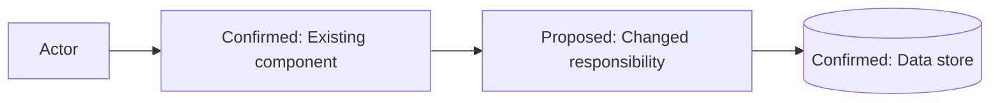

# High-Level Design Guidelines

The HLD explains system shape, ownership, interactions, and the reason for change. It must be understandable without pretending unsupported current-state details are known.

## Current architecture

Describe only the slice relevant to the Stories:

- users and external actors;
- system or module boundary;
- major components and their responsibilities;
- current entry points and integrations;
- data ownership;
- deployment or trust boundaries when relevant;
- known limitations driving the change.

Attach evidence labels and references. If the current component name is unknown, describe its responsibility and mark the name Unknown; do not invent one.

## Proposed architecture

Explain:

- the reason for change;
- the smallest set of changed or new responsibilities;
- reused components and why they fit;
- new components only when necessary;
- ownership of orchestration and business rules;
- data and control flow;
- integration and compatibility approach;
- security and transaction boundaries;
- observability and deployment implications;
- deliberate non-changes.

Use **Proposed** in diagram nodes and prose for elements not confirmed to exist.

## Repository evidence

When DeepWiki research succeeds, precede the HLD with an Existing Architecture Summary and use its retrieved evidence to distinguish:

- Confirmed current repositories, layers, and components;
- Inferred implementation patterns;
- existing components reused;
- Proposed new components;
- similar implementations and extension points;
- limitations and repository conflicts.

When repository research is unavailable, keep the HLD conceptual. Do not invent exact class, file, package, service, or table names. State that implementation-specific details require repository verification.

## Component responsibilities

For each material component state:

| Component | Current responsibility | Proposed change | Inputs/outputs | Dependencies | Failure behavior | Evidence status |
|---|---|---|---|---|---|---|

Avoid overlapping responsibilities. Identify the single owner of each business rule, state transition, and data write.

## Interaction design

For each call or message, consider:

- initiator and recipient;
- synchronous or asynchronous behavior;
- request or event contract;
- authentication and authorization;
- latency and timeout;
- retry and idempotency;
- ordering and duplicate handling;
- transaction or consistency expectation;
- error propagation and user-visible outcome;
- correlation and monitoring.

Do not propose asynchronous delivery without defining delivery semantics and reconciliation.

## Data flow

Trace important data from collection to use, persistence, integration, audit, and deletion or retention where relevant. Identify sensitive fields and trust-boundary crossings.

Do not reproduce real patient or beneficiary data in the design.

## Alternatives

Compare credible options against the same drivers. Useful dimensions include:

- fit with current architecture;
- implementation and operational complexity;
- compatibility;
- data consistency;
- failure isolation;
- security and privacy;
- performance and scale;
- deployment and rollback;
- maintainability and ownership.

Include "do nothing" only when it is a realistic choice. Do not invent weak alternatives to make the recommendation appear stronger.

## Major decision examples

Material decisions commonly include:

- reuse versus new endpoint;
- extend existing module versus new service;
- synchronous versus asynchronous integration;
- persisted versus derived state;
- backward-compatible extension versus versioned contract;
- transaction boundary;
- cache ownership and invalidation;
- feature flag or coordinated deployment;
- migration and rollback strategy.

## Mermaid component diagram

Use a flowchart when component relationships materially aid review:

Adapt orientation to readability. Add external systems and trust boundaries only when relevant. Do not create false precision by showing undocumented internals.

## HLD completion check

Confirm that the HLD:

- distinguishes current and proposed architecture;
- explains the reason for change, reuse, new proposals, and repository evidence;
- names ownership and boundaries;
- explains key flows and failure behavior;
- justifies reuse and new elements;
- records alternatives and trade-offs;
- covers integration, data, security, observability, and rollout;
- states assumptions, risks, and deliberate non-changes;
- traces decisions to approved scope.
