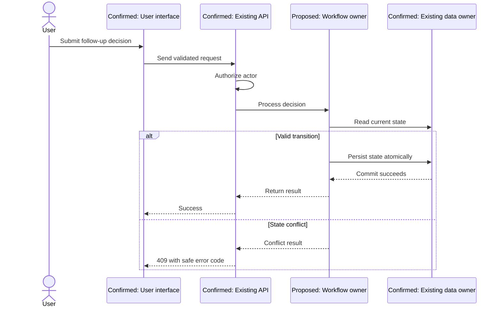
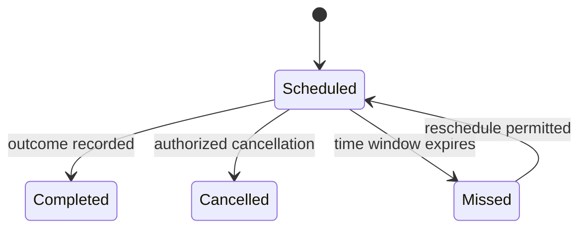

# Sequence Diagram Guidelines

Use a sequence diagram when ordering, responsibility, failure handling, or transaction boundaries are difficult to understand from prose.

## Value test

Create a diagram when at least one is true:

- three or more participants collaborate;
- a call crosses service, trust, or ownership boundaries;
- alternate or failure paths affect the design;
- retry, callback, queue, or asynchronous completion exists;
- transaction timing matters;
- authorization and audit order matters;
- concurrency or duplicate handling matters.

Skip it for a simple request-response that one short numbered list explains better.

## Participant rules

- Use confirmed names only when sourced.
- Prefix proposed participants with `Proposed:`.
- Use responsibility names when current component names are unknown.
- Include the actor, entry point, decision owner, data owner, and external system only when relevant.
- Do not expose internal URLs, credentials, or sensitive identifiers.

## Message rules

Label messages with intent, not method signatures. Show:

- identity or authorization check;
- meaningful validation;
- state lookup and write;
- integration call or event;
- transaction start/end only when important;
- user-visible outcome;
- audit or monitoring event when architecturally relevant.

Avoid getter-level noise.

## Alternatives and failures

Use `alt`, `opt`, `loop`, `par`, and notes sparingly. Show a failure path when it changes retry, rollback, user outcome, or operational response.

Example:

## Transaction and remote-call notation

When transaction boundaries matter, add notes identifying which interactions occur inside and outside the transaction. Do not imply an external call is atomic with a database write.

For asynchronous work show:

- durable handoff point;
- acknowledgement timing;
- delivery and ordering assumption;
- idempotent consumer;
- retry and dead-letter or reconciliation path;
- final status visibility.

## State diagrams

Use a state diagram when persistent lifecycle rules are central:

Document guards, actors, and invalid transitions in prose. Do not add states unsupported by requirements or proposed design.

## Consistency checks

Before presenting a diagram, verify:

- every participant is defined in the design;
- current and proposed status is visible;
- message direction matches ownership;
- prose and diagram use the same names;
- errors and retries match the LLD;
- transactions do not cross remote calls accidentally;
- Mermaid fences and syntax are plausible;
- the diagram adds review value.
